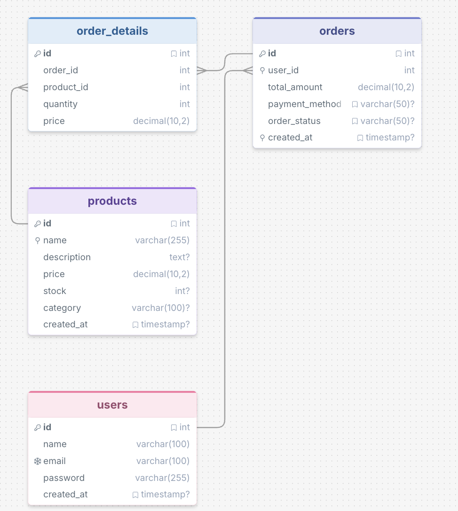

````md
# 🚀 Digitivity Full-Stack Assessment - SET 3

This project contains my full-stack assessment tasks:

- React Weather Search (Debouncing + Infinite Scroll)
- MySQL E-Commerce Database
- Express.js API (SQL + MongoDB versions)

---

# 📁 Project Structure

- Frontend-Tasks → React weather search app
- Backend-Task/Sql → Express API using MySQL
- Backend-Task/MongoDB → Express API using MongoDB
- Ecommerce-db-design → SQL schema + seed data

---

# 🌤️ Task 1 - React Weather Search

### What I did
- Created a search bar in React
- Added debouncing using `setTimeout` to reduce API calls
- Used OpenWeatherMap API to fetch weather data
- Added infinite scroll to load more results automatically
- Styled using Tailwind CSS

### ▶️ How to run

```bash
cd Frontend-Tasks
npm install
npm run dev
````

---

# 🗄️ Task 2 - MySQL Database

### What I did

* Created `ecommerce_db` database
* I have added design image in the Ecommerce-db-design folder
  
* Created tables:

  * users
  * products
  * orders
  * order_details
* Added relationships using foreign keys
* Added indexing for better performance

---

### ▶️ How to set up database

Go to:

```
Ecommerce-db-design
```

Run the `schema.sql` file in MySQL Workbench to create the database and tables.

---

### ▶️ How to insert data

Run the `seed.sql` file to insert sample data into the database.

---

# 🚀 Task 3 - Order Management API

For Task 3, I implemented APIs using both SQL and MongoDB to demonstrate understanding of relational and NoSQL databases.

---

## 📁 SQL Version

Path:

```
Backend-Task/Sql
```

### What I did

* Built Express.js API using MySQL
* Used JOIN queries to fetch relational data
* Implemented:

  * GET /orders
  * GET /orders/:id

### ▶️ How to run SQL backend

```bash
cd Backend-Task/Sql
npm install
npm run dev
```

Before running:

* Run `schema.sql` to create DB
* Run `seed.sql` to insert data
* Update DB credentials in `db.js`

Server runs at:

```
http://localhost:5001
```

---

## 🍃 MongoDB Version

Path:

```
Backend-Task/MongoDB
```

### What I did

* Built Express.js API using MongoDB + Mongoose
* Used `populate()` for relational data
* Implemented:

  * GET /orders
  * GET /orders/:id

### ▶️ How to run MongoDB backend

```bash
cd Backend-Task/MongoDB
npm install
npm run dev
```

Note:

* MongoDB is connected using MongoDB Atlas (cloud database)
* No local setup required

---

# 🔗 API Endpoints

## SQL Version

* GET /orders → fetch all orders
* GET /orders/:id → fetch single order details

## MongoDB Version

* GET /orders → fetch all orders
* GET /orders/:id → fetch single order details

---

# ⚡ Key Learnings

* React debouncing and infinite scroll
* MySQL relational database design
* MongoDB schema design
* JOIN queries vs populate()
* Express.js API development
* Indexing for performance optimization

---

